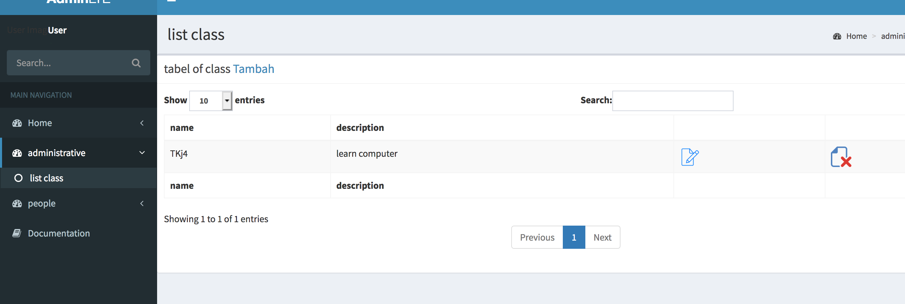
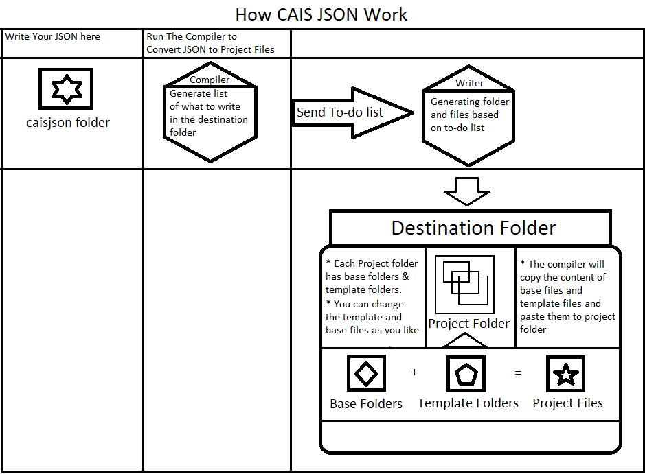
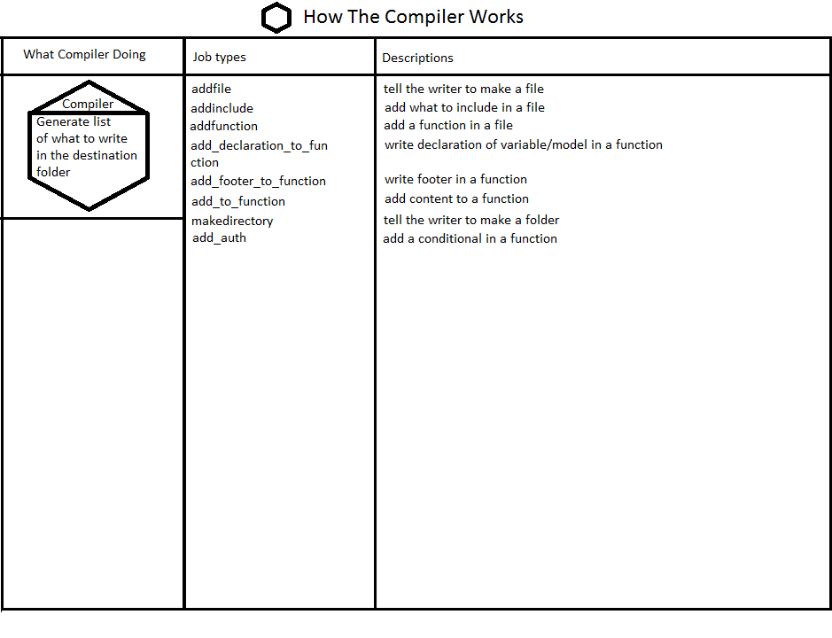
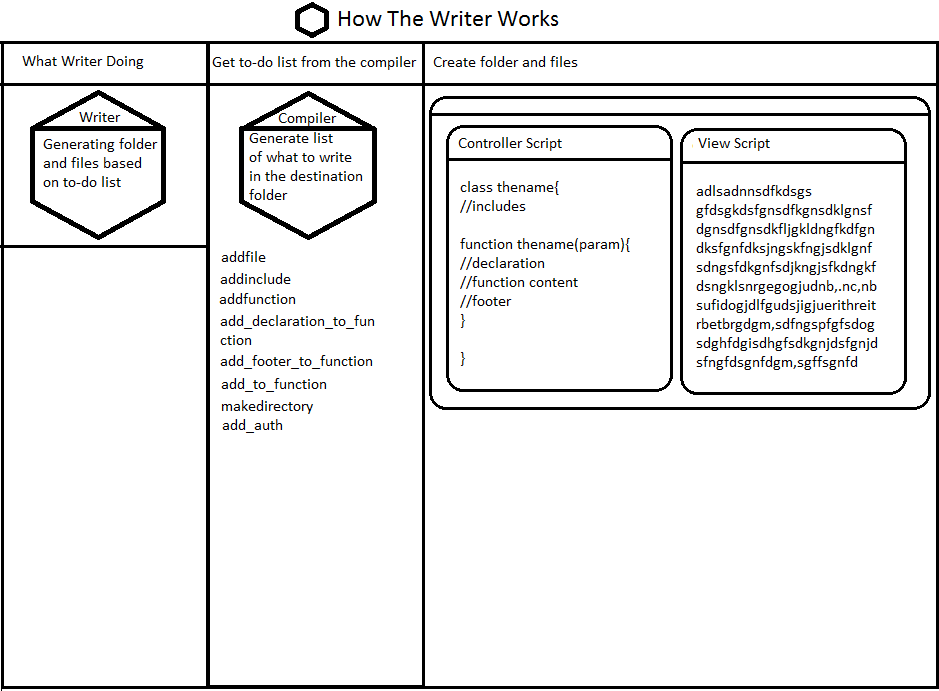
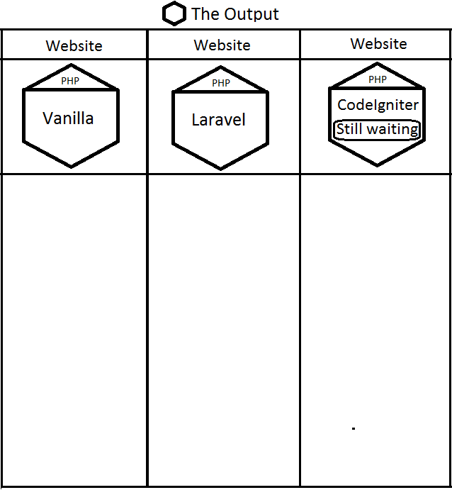

# CAIS JSON

## Create Admin In Seconds
### Open source tool for web programmer to compile JSON into : html files, php files, APIs and documentations




### Auto Crud Example
```json

{

  "modul":"administrative"
  ,"page":"class"
  ,"master":[
    {
      "table":"tb_class"
        ,"column":[
        {
          "column":"name"
        }
        ,
        {
          "column":"description"
        }
      ]
      ,"field_add":{
        "field":[
          {
            "field":"name"
          }
          ,
          {
            "field":"description"
          }
        ]
      }
      ,"field_edit":{
        "field":[
          {
            "field":"name"
          }
          ,
          {
            "field":"description"
          }
        ]
      }
      ,"field_delete":{
        "field":[
          {
            "field":"name"
          }
          ,
          {
            "field":"description"
          }
        ]
      }

    }
  ]

}
,
{

  "modul":"people"
  ,"page":"student"
  ,"master":[
    {
      "table":"tb_student"
        ,"column":[
        {
          "column":"name"
        }
        ,
        {
          "column":"photo"
          ,"type":"image"
        }
        ,
        {
          "column":"address"
        }
      ]
      ,"field_add":{
        "field":[
          {
            "field":"name"
          }
          ,
          {
            "field":"address"
          }
          ,
          {
            "field":"photo"
            ,"type":"image_upload"
          }
        ]
      }
      ,"field_edit":{
        "field":[
          {
            "field":"name"
          }
          ,
          {
            "field":"address"
          }
          ,
          {
            "field":"photo"
            ,"type":"image_upload"
          }
        ]
      }
      ,"field_delete":{
        "field":[
          {
            "field":"name"
          }
          ,
          {
            "field":"address"
          }
          ,
          {
            "field":"photo"
            ,"type":"image_upload"
          }
        ]
      }

    }
  ]

}

```









# Installation

## Vanilla
* Copy vanilla folder to your htdocs and rename as you like

## Laravel

* Create laravel project with composer
* Create helper file with name helpers.php in app folder (app/helpers.php)
* Remove public from your url so it is become localhost/yourweb/admin and not localhost/yourweb/public/admin
* Copy bower_components folder to (your laravel folder)/public

# How to use it

* Write your JSON files inside caisjson/thejson
* access http://localhost/caisjson/?job=compile&platform=weblaravel&main_file=main_file from web
* platform=weblaravel is tell compiler to make laravel program
* main_file=main_file is to open thejson/main_file.json and execute it as the project manifest file
* You can create different main file for different project

# Documentations

For more documentations, read the wiki page :)
